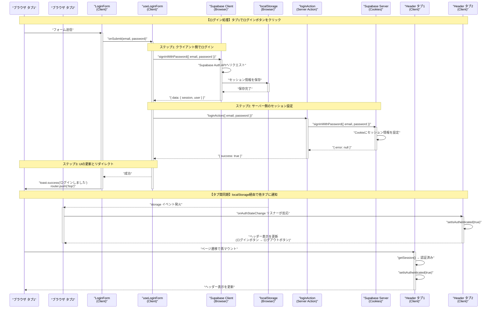
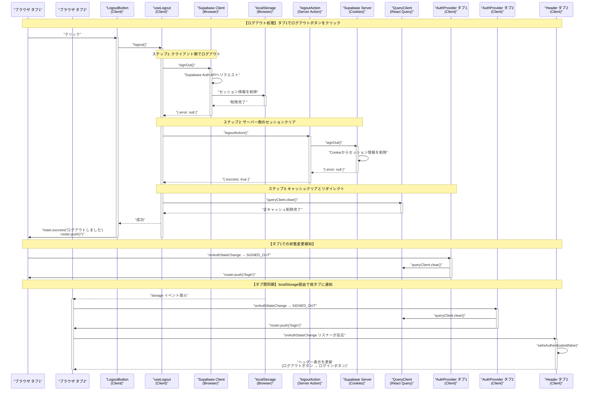
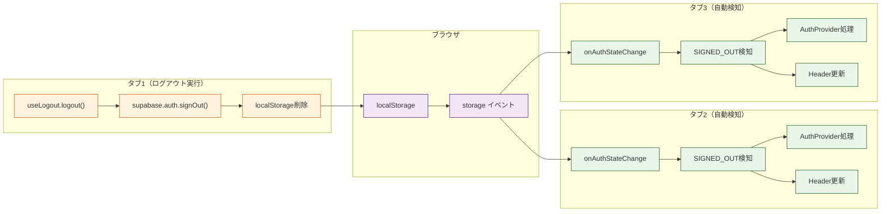
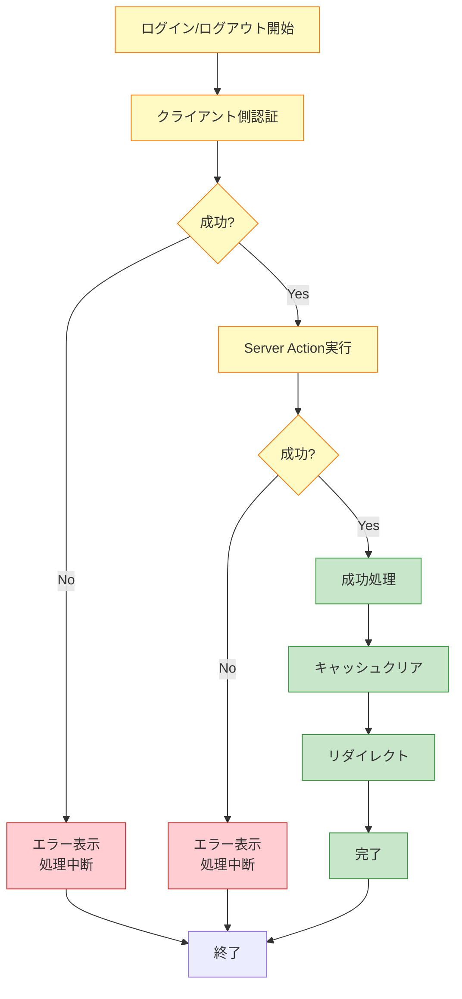

# 認証フロー アーキテクチャ

## 概要

このドキュメントは、ログイン・ログアウト時の処理フローと、複数タブ間での認証状態同期の仕組みを説明します。
Supabase Auth、Next.js App Router、クライアント/サーバー間の連携方法を理解するための参考資料です。

## 主要な技術要素

- **Supabase Auth**: 認証サービス（Cookie-based Session）
- **localStorage**: ブラウザのタブ間通信メカニズム
- **onAuthStateChange**: Supabase の認証状態監視リスナー
- **Server Actions**: Next.js のサーバー側処理
- **Client-side Auth**: ブラウザ側での認証処理

## アーキテクチャ図

### ログインフロー



### ログアウトフロー



## コンポーネント構成

```mermaid
graph TB
    subgraph "Server Component Layer"
        Layout["📄 layout.tsx<br/>Server Component"]
        DAL["getUser()<br/>DAL関数"]

        Layout -->|getUser()| DAL
        DAL -->|初期認証状態| Layout
    end

    subgraph "Client Component Layer"
        Providers["🔄 Providers<br/>QueryClient + AuthProvider"]
        AuthProvider["🔐 AuthProvider<br/>認証状態監視"]
        Header["📱 Header<br/>Client Component"]
        LoginForm["📝 LoginForm"]
        LogoutButton["🚪 LogoutButton"]

        useLoginForm["🎣 useLoginForm Hook"]
        useLogout["🎣 useLogout Hook"]
    end

    subgraph "Browser APIs"
        SupabaseClient["🔑 Supabase Client<br/>(Browser)"]
        LocalStorage["💾 localStorage<br/>タブ間通信"]
    end

    subgraph "Server Layer"
        LoginAction["⚙️ loginAction<br/>Server Action"]
        LogoutAction["⚙️ logoutAction<br/>Server Action"]
        SupabaseServer["🍪 Supabase Server<br/>(Cookies)"]
    end

    Layout -->|initialAuth prop| Header
    Layout --> Providers
    Providers --> AuthProvider
    Providers --> Header

    Header --> LogoutButton
    LoginForm --> useLoginForm
    LogoutButton --> useLogout

    useLoginForm -->|1. signInWithPassword| SupabaseClient
    useLoginForm -->|2. loginAction| LoginAction
    useLogout -->|1. signOut| SupabaseClient
    useLogout -->|2. logoutAction| LogoutAction

    SupabaseClient <-->|session data| LocalStorage
    LocalStorage -.->|storage event| AuthProvider
    LocalStorage -.->|storage event| Header

    LoginAction --> SupabaseServer
    LogoutAction --> SupabaseServer

    AuthProvider -->|SIGNED_OUT検知| AuthProvider
    Header -->|認証状態変化検知| Header

    classDef server fill:#e1f5ff,stroke:#01579b
    classDef client fill:#fff3e0,stroke:#e65100
    classDef browser fill:#f3e5f5,stroke:#4a148c
    classDef serverAction fill:#e8f5e9,stroke:#1b5e20

    class Layout,DAL server
    class Providers,AuthProvider,Header,LoginForm,LogoutButton,useLoginForm,useLogout client
    class SupabaseClient,LocalStorage browser
    class LoginAction,LogoutAction,SupabaseServer serverAction
```

## 詳細な処理フロー

### 1️⃣ 初期レンダリング（Server Component）

**ファイル**: `src/app/layout.tsx`

```typescript
export default async function RootLayout({ children }: { children: React.ReactNode }) {
  // サーバー側で認証状態を取得（リダイレクトなし）
  const user = await getUser();

  return (
    <html lang="ja">
      <body>
        <Providers>
          {/* 初期認証状態をpropsで渡す */}
          <Header initialAuth={!!user} />
          <main>{children}</main>
        </Providers>
      </body>
    </html>
  );
}
```

**ファイル**: `src/supabase/dal.ts`

```typescript
export const getUser = cache(async () => {
  const supabase = await createServerSupabaseClient();

  const {
    data: { user },
    error,
  } = await supabase.auth.getUser();

  // 未認証の場合はnullを返す（リダイレクトしない）
  if (error || !user) {
    return null;
  }

  return user;
});
```

**ポイント**:

- ✅ サーバー側で認証状態を取得し、初期表示に反映
- ✅ `cache()` でリクエスト内で結果を再利用
- ✅ 未認証でもリダイレクトしない（表示の切り替えのみ）
- ✅ ちらつき防止（正しい初期状態で表示）

---

### 2️⃣ クライアント側の認証状態監視

#### Header Component

**ファイル**: `src/components/layout/Header.tsx`

```typescript
'use client';

export default function Header({ initialAuth }: { initialAuth?: boolean }) {
  const [isAuthenticated, setIsAuthenticated] = useState(initialAuth);

  useEffect(() => {
    const supabase = createBrowserSupabaseClient();

    // 初期状態を取得（クライアント側で再確認）
    supabase.auth.getSession().then(({ data: { session } }) => {
      setIsAuthenticated(!!session);
    });

    // 認証状態の変更を監視（タブ間同期のキー）
    const {
      data: { subscription },
    } = supabase.auth.onAuthStateChange((_event, session) => {
      setIsAuthenticated(!!session);
    });

    return () => {
      subscription.unsubscribe();
    };
  }, []);

  return (
    <header>
      {/* 認証状態に応じて表示を切り替え */}
      {isAuthenticated ? <LogoutButton /> : <Link href="/login">ログイン</Link>}
    </header>
  );
}
```

**ポイント**:

- ✅ Server Componentから初期値を受け取る
- ✅ `onAuthStateChange` で認証状態をリアルタイム監視
- ✅ **他タブでのログイン/ログアウトを検知可能**
- ✅ localStorage経由のイベントで自動更新

#### AuthProvider Component

**ファイル**: `src/providers/AuthProvider.tsx`

```typescript
'use client';

export function AuthProvider({ children }: { children: React.ReactNode }) {
  const queryClient = useQueryClient();
  const router = useRouter();

  useEffect(() => {
    const supabase = createBrowserSupabaseClient();

    const {
      data: { subscription },
    } = supabase.auth.onAuthStateChange((event) => {
      // ログアウトが検知された場合のみ処理
      if (event === 'SIGNED_OUT') {
        // React Queryのキャッシュをクリア
        queryClient.clear();

        // ログインページにリダイレクト
        router.push('/login');
      }

      // ログイン時はリダイレクトしない（各フォームが責任を持つ）
      // ヘッダーの表示切り替えはHeaderコンポーネントのonAuthStateChangeで処理される
    });

    return () => {
      subscription.unsubscribe();
    };
  }, [queryClient, router]);

  return <>{children}</>;
}
```

**ポイント**:

- ✅ SIGNED_OUT イベントのみ処理
- ✅ キャッシュクリアとリダイレクトを実行
- ✅ **全タブで同時にログアウト処理が実行される**
- ✅ ログイン時はリダイレクトしない（useLoginFormが管理）

---

### 3️⃣ ログイン処理

**ファイル**: `src/app/(auth)/_hooks/useLoginForm.ts`

```typescript
export function useLoginForm() {
  const router = useRouter();

  const onSubmit = async (data: LoginFormData) => {
    // 1. クライアント側でログイン（重要: タブ間同期のため）
    const supabase = createBrowserSupabaseClient();
    const { error: clientError } = await supabase.auth.signInWithPassword({
      email: data.email,
      password: data.password,
    });

    if (clientError) {
      toast.error('ログインに失敗しました');
      return;
    }

    // 2. サーバー側のセッションも設定
    const result = await loginAction(data);

    if (result?.error) {
      toast.error(result.error);
      return;
    }

    if (result?.success) {
      toast.success('ログインしました');
      router.push('/top');
    }
  };

  return { onSubmit, /* ... */ };
}
```

**ファイル**: `src/app/(auth)/_lib/actions.ts`

```typescript
'use server';

export async function loginAction(data: LoginFormData) {
  const supabase = await createServerSupabaseClient();

  const { error } = await supabase.auth.signInWithPassword({
    email: data.email,
    password: data.password,
  });

  if (error) {
    return { error: 'ログインに失敗しました' };
  }

  revalidatePath('/', 'layout');
  return { success: true };
}
```

**処理順序**:

1. **クライアント側ログイン**: `supabase.auth.signInWithPassword()`
   - localStorageにセッション保存
   - **onAuthStateChange イベント発火**（全タブ）
2. **サーバー側ログイン**: `loginAction()`
   - Cookie にセッション保存
   - サーバー側での認証を有効化
3. **リダイレクト**: `/top` へ遷移

**ポイント**:

- ✅ **クライアント側ログインが必須**（タブ間同期のため）
- ✅ サーバー側ログインも必須（SSRでの認証のため）
- ✅ 両方成功して初めてログイン完了
- ✅ 他タブのHeaderが自動的に更新される

---

### 4️⃣ ログアウト処理

**ファイル**: `src/app/(auth)/_hooks/useLogout.ts`

```typescript
export function useLogout() {
  const [loading, setLoading] = useState(false);
  const router = useRouter();
  const queryClient = useQueryClient();

  const logout = async () => {
    setLoading(true);

    try {
      // 1. クライアント側でログアウト（重要: タブ間同期のため）
      const supabase = createBrowserSupabaseClient();
      const { error: clientError } = await supabase.auth.signOut();

      if (clientError) {
        toast.error('ログアウトに失敗しました');
        setLoading(false);
        return;
      }

      // 2. サーバー側のセッションもクリア
      const result = await logoutAction();

      if (result?.error) {
        toast.error(result.error);
        setLoading(false);
        return;
      }

      // 3. React Queryのキャッシュをクリア
      queryClient.clear();
      toast.success('ログアウトしました');
      router.push('/');
    } catch (error) {
      toast.error('ログアウトに失敗しました');
      setLoading(false);
    }
  };

  return { logout, loading };
}
```

**ファイル**: `src/app/(auth)/_lib/actions.ts`

```typescript
'use server';

export async function logoutAction() {
  const supabase = await createServerSupabaseClient();

  const { error } = await supabase.auth.signOut();

  if (error) {
    return { error: 'ログアウトに失敗しました' };
  }

  revalidatePath('/', 'layout');
  redirect('/login');
}
```

**処理順序**:

1. **クライアント側ログアウト**: `supabase.auth.signOut()`
   - localStorageからセッション削除
   - **onAuthStateChange イベント発火**（全タブで SIGNED_OUT）
2. **サーバー側ログアウト**: `logoutAction()`
   - Cookie からセッション削除
   - サーバー側での認証を無効化
3. **キャッシュクリア**: `queryClient.clear()`
4. **リダイレクト**: `/` へ遷移

**ポイント**:

- ✅ **クライアント側ログアウトが必須**（タブ間同期のため）
- ✅ サーバー側ログアウトも必須（SSRでの認証解除のため）
- ✅ 全タブで AuthProvider の SIGNED_OUT ハンドラが実行される
- ✅ 全タブで `/login` にリダイレクトされる

---

## タブ間同期の仕組み



### localStorage イベントの仕組み

1. **タブ1**: `supabase.auth.signOut()` を実行
2. **Supabase Client**: localStorage のセッションデータを削除
3. **ブラウザ**: `storage` イベントを**他のタブ**に配信
4. **タブ2, 3, ...**: `onAuthStateChange` リスナーがイベントをキャッチ
5. **各タブ**: 独立して SIGNED_OUT 処理を実行

**重要な特性**:

- ✅ イベントは**操作を実行したタブ以外**に配信される
- ✅ 同一オリジンの全タブで同時に検知される
- ✅ Supabase が内部的に localStorage を使用している
- ✅ 開発者が明示的に実装する必要はない

---

## クライアント側 vs サーバー側

### なぜ両方必要？

| 側面               | クライアント側                             | サーバー側                           |
| ------------------ | ------------------------------------------ | ------------------------------------ |
| **実行場所**       | ブラウザ                                   | Next.js サーバー                     |
| **保存先**         | localStorage                               | Cookie（httpOnly）                   |
| **役割**           | タブ間同期、リアルタイム状態更新           | SSR、API認証                         |
| **イベント発火**   | ✅ `onAuthStateChange` が発火する          | ❌ イベント発火しない                |
| **タブ間同期**     | ✅ 可能（localStorage経由）                | ❌ 不可能                            |
| **セキュリティ**   | ❌ JavaScriptからアクセス可能              | ✅ httpOnly Cookieで保護             |
| **SSR対応**        | ❌ Server Componentで使用不可              | ✅ Server Componentで使用可能        |
| **省略した場合**   | タブ間同期が動作しない、表示が更新されない | SSRが動作しない、サーバー側で認証失敗 |

### 処理の順序が重要な理由

**ログイン時**:

```typescript
// ❌ 悪い例: サーバー側だけ
await loginAction(data); // イベント発火しない → タブ間同期しない

// ✅ 良い例: クライアント側 → サーバー側
await supabase.auth.signInWithPassword(); // イベント発火 → タブ間同期
await loginAction(data); // Cookie設定 → SSR対応
```

**ログアウト時**:

```typescript
// ❌ 悪い例: サーバー側だけ
await logoutAction(); // イベント発火しない → タブ間同期しない

// ✅ 良い例: クライアント側 → サーバー側
await supabase.auth.signOut(); // イベント発火 → タブ間同期
await logoutAction(); // Cookie削除 → SSR対応
```

---

## エラーハンドリング



---

## キーポイント

### ✅ タブ間同期が動作する理由

1. **Supabase Client** が localStorage にセッション保存
2. **localStorage の変更** がブラウザの `storage` イベントを発火
3. **他タブの `onAuthStateChange`** がイベントをキャッチ
4. **各タブが独立して** 認証状態を更新

### ✅ クライアント側認証が必須な理由

| ケース                       | クライアント側あり                 | クライアント側なし（Server Actionのみ） |
| ---------------------------- | ---------------------------------- | --------------------------------------- |
| ログイン/ログアウトしたタブ  | ✅ 即座に更新                      | ✅ リダイレクトで更新                   |
| **他のタブ**                 | ✅ **自動的に更新**                | ❌ **更新されない**                     |
| Header表示                   | ✅ **リアルタイム更新**            | ❌ **リロードまで古いまま**             |
| AuthProvider                 | ✅ **SIGNED_OUT検知**              | ❌ **検知できない**                     |
| localStorage                 | ✅ **セッション保存**              | ❌ **保存されない**                     |
| onAuthStateChange イベント   | ✅ **発火する**                    | ❌ **発火しない**                       |

### ✅ 各コンポーネントの責務

| コンポーネント  | 責務                                                     | イベント監視 |
| --------------- | -------------------------------------------------------- | ------------ |
| **AuthProvider**    | ログアウト検知、キャッシュクリア、リダイレクト           | ✅ SIGNED_OUT のみ |
| **Header**          | 認証状態に応じた表示切り替え                             | ✅ 全イベント      |
| **useLoginForm**    | ログイン処理、エラーハンドリング、ログイン後のリダイレクト | ❌             |
| **useLogout**       | ログアウト処理、エラーハンドリング                       | ❌             |
| **layout.tsx**      | 初期認証状態の取得（SSR）                                | ❌             |

---

## トラブルシューティング

### Q: 他タブでヘッダーが更新されない

**原因**: クライアント側認証を省略している

```typescript
// ❌ 悪い例
await loginAction(data);

// ✅ 良い例
await supabase.auth.signInWithPassword({ email, password });
await loginAction(data);
```

### Q: ログアウト後もデータが表示される

**原因**: React Query のキャッシュがクリアされていない

```typescript
// ✅ useLogout で必ず実行
queryClient.clear();
```

### Q: リロードすると認証が切れる

**原因**: サーバー側認証を省略している

```typescript
// ❌ 悪い例
await supabase.auth.signInWithPassword({ email, password });

// ✅ 良い例
await supabase.auth.signInWithPassword({ email, password });
await loginAction(data); // Cookie設定が必要
```

---

## 参考資料

- [Supabase Auth - JavaScript Client Library](https://supabase.com/docs/reference/javascript/auth-signinwithpassword)
- [Supabase Auth - Server-Side Auth](https://supabase.com/docs/guides/auth/server-side)
- [Next.js - Server Actions](https://nextjs.org/docs/app/building-your-application/data-fetching/server-actions-and-mutations)
- [MDN - Window: storage event](https://developer.mozilla.org/en-US/docs/Web/API/Window/storage_event)
